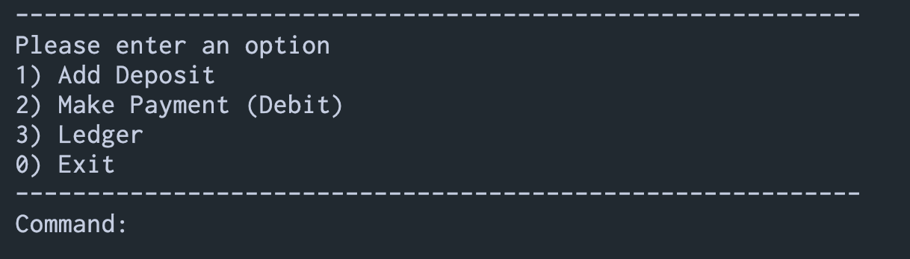
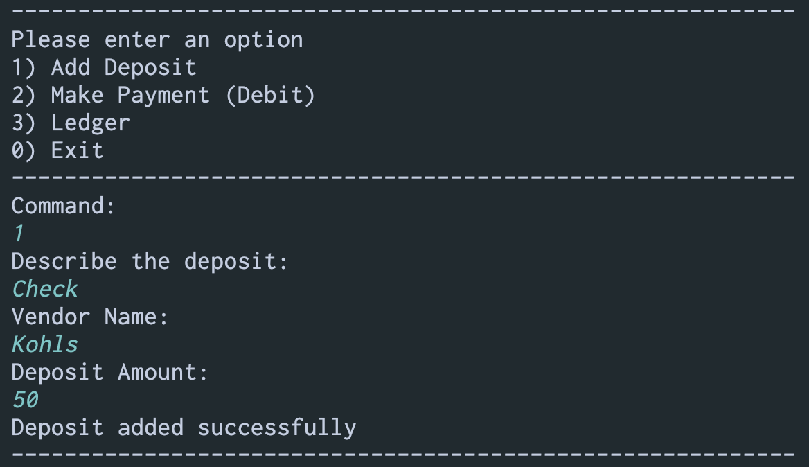
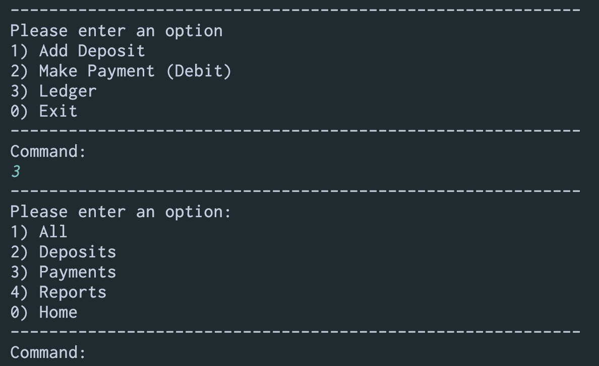
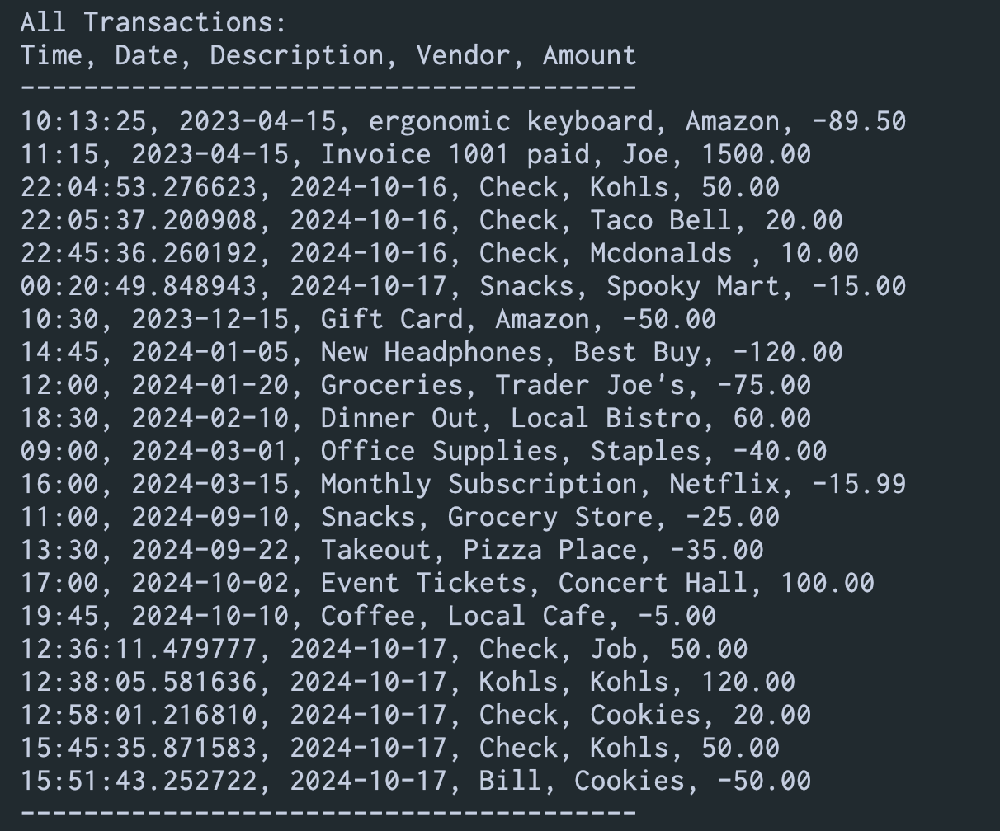
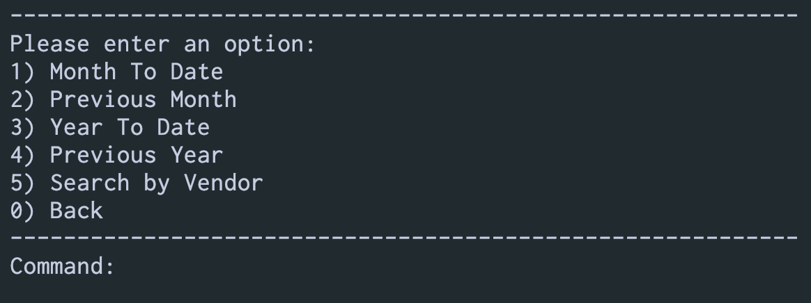

# Capstone One - Accounting Ledger

## Summary:

Hello! This Accounting Ledger is my first Java Project. It is a command-line accounting application created to help manage financial transactions effeciently. It has the ability to

### - Add Transactions
Users can input deposits and payments along with descriptions and vendor information.
### - View Transactions
The application allows users to display all transactions or filter them by type, such as deposits or payments.
### - Generate Reports
Users can produce reports for specific time frames, including the current month, previous month, current year, and previous year.
### - Search by vendor
The application enables quick searches for transactions associated with a specific vendor.

## Menu Structure

### Home Screen

The main menu is the first screen the user sees in the accounting ledger. The user has 3 initial options, Add deposit, Add Payment, and an option to open a seperate ledger menu. The first 2 options are similar in nature in the sense that they both are used to create transactions and write them to the transactions file the program reads from.

### Add Deposit

The add deposit option prompts the user to enter a description, vendor, and deposit amount, while getting the current time and date. The program then writes the transaction to the CSV file and states the deposit was added successfully.

### Make Payment

The make payment screen is similar to the deposit screen, only that it records the transaction as a negative.

## Ledger Menu

When the ledger screen is accessed, it introduces a sub menu to the viewer, now allowing for the user to have the option of viewing all transactions, all deposits, or all payments. The 4th option would be to access the 3rd Reports menu. Here is a sample of the "All Transactions" option.

### All transactions

The all transactions options prints out a structured, easy to read, transaction list convinient for the user.

## Reports Menu

The reports menu allows the user to request refined reports for viewing transactions meeting certain criteria. The reports menu allows the user to request based on month to date, year to date, and other time based reports. Also, it allows the user the option to search by vendor.

### Year to date report

requesting the year to date option provides an easy to read and structured output of the transactions found being within the last year.